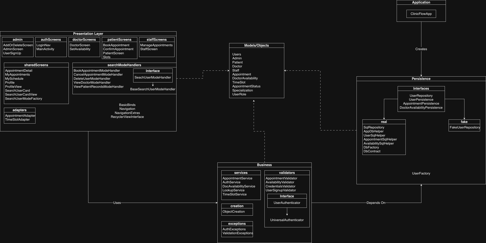

# ClinicFlow Architecture
## Architecture Diagram

## Major Packages and Source Code Components
### `Application`

* **`ClinicFlowApp`**

    * Initializes shared application-level objects.

---

### `Presentation`

**Responsibility:** Handles navigation between screens. Handles what to display and for whom.

**Subpackages**

* **`admin`**

    * `AddOrDeleteScreen`
    * `AdminScreen`
    * `UserSignUp`

* **`authScreens`**

    * `LoginNav`
    * `MainActivity`

* **`doctorScreens`**

    * `DoctorScreen`
    * `SetAvailability`

* **`patientScreens`**

    * `BookAppointment`
    * `ConfirmAppointment`
    * `PatientScreen`
    * `Slots`

* **`staffScreens`**

    * `ManageAppointments`
    * `StaffScreen`

* **`sharedScreens`**

  * `AppointmentDetail`
  * `MyAppointments`
  * `MySchedule`
  * `Profile`
  * `ProfileView`
  * `SearchUserCard`
  * `SearchUserCardView`
  * `SearchUserModeFactory`

  * **`searchModeHandlers`**

    * `BaseSearchUserModeHandler`
    * `BookAppointmentModeHandler`
    * `CancelAppointmentModeHandler`
    * `DeleteUserModeHandler`
    * `ViewDoctorModeHandler`
    * `ViewPatientRecordsModeHandler`
    * **Interface:** `SearchUserModeHandler`

* **`adapters`**

    * `AppointmentAdapter`
    * `TimeSlotAdapter`

**Files not in subpackages**

* `BasicBinds`
* `Navigation`
* `NavigationExtras`
* **Interface:** `RecyclerViewInterface`

**How it works** - Any Activity that needs can retrieve any shared service from ClinicFlowApp that they need. - When an Activity needs to use business logic, it calls the necessary method through that shared service it retrieved from ClinicFlowApp - Navigation assists in navigation from one activity to another - NavigationExtras houses the Intent extra keys used for passing data between activities - BasicBinds binds the logout, back, and profile buttons to their respective IDs and then sets the onClickListeners for them.
---

### `Business`

**Responsibility:** Implements application use-cases and rules using the persistence interfaces.

**Subpackages**

* **`services`**

    * `AppointmentService`
    * `AuthService`
    * `DocAvailabilityService`
    * `LookupService`
    * `TimeSlotService`

* **`validators`**

    * `AppointmentValidator`
    * `AvailabilityValidator`
    * `CredentialsValidator`
    * `UniversalAuthenticator`
    * `UserSignupValidator`
    * **Interface:** `UserAuthenticator`

* **`exceptions`**

    * `AuthExceptions`
    * `ValidationExceptions`

* **`creation`**

    * `ObjectCreation`

---

### `Persistence`

**Responsibility:** Stores different users, appointments (past and future), and availabilities.

**Interfaces**

* `UserRepository`
* `UserPersistence`
* `AppointmentPersistence`
* `DoctorAvailabilityPersistence`

**Subpackages**

* **`fake`**

    * `FakeUserRepository`

* **`real`**

    * `SqlRepository`
    * `AppDbHelper`
    * `UserSqlHelper`
    * `AppointmentSqlHelper`
    * `AvailabilitySqlHelper`
    * `DbFactory`
    * `DbContract`

**Other classes**

* `UserFactory`

---

### `Models`

**Responsibility:** Shared model objects and enums.

**Classes / enums**

* `Users`
* `Admin`
* `Appointment`
* `AppointmentStatus`
* `Doctor`
* `DoctorAvailability`
* `Patient`
* `Specialization`
* `Staff`
* `TimeSlot`
* `UserRole`

