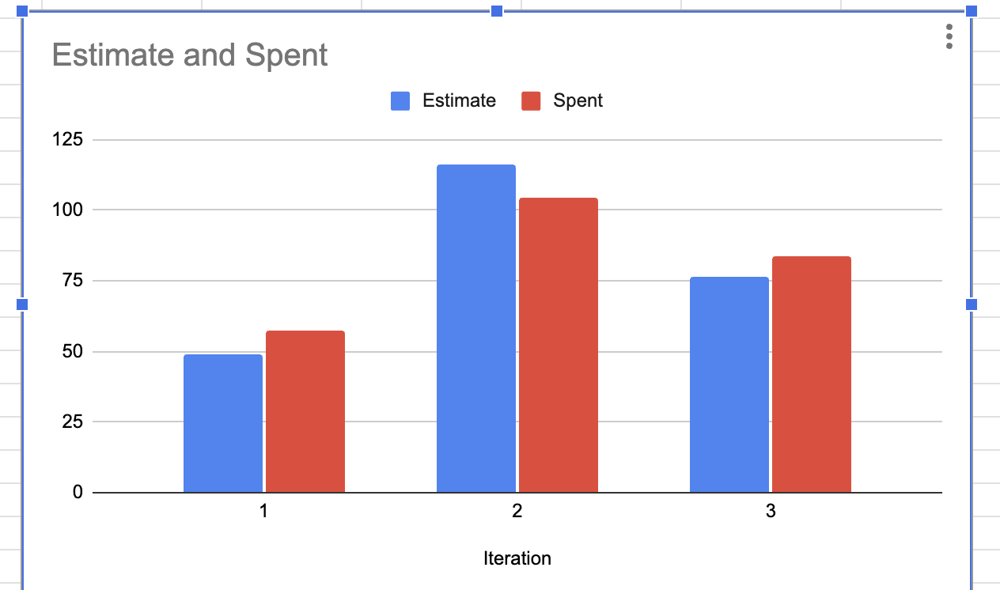

# One meaningful weakness from prior iteration
One of the prior weakness that we had and was solved in this iteration was email being treated as a system-wide identity, but is only validated as unique only for Patients. In UserSignupValidator, duplicate checking getPatientByEmail, yet the same validator is reused for doctor and staff creation, and later deleteUser / getUserByEmail assume one email maps to one account.
This created design inconsistencies as business layer treated email as a universal key while
persistence contract only enforces it per role table.

# Concrete action taken
In UserSignupValidator, validateDuplicateEmail was changed to validate by UserEmail instead of specific
user ie Patient, Doctor, etc. Now email is used as a system-wide identity and each user is validated through their email. Duplicate checks are now being done for every type of user whereas previously it was only patients.
Updated the repository to support cross role lookup and ensured all user creation paths call the same validator.

Replaced role specific repository calls with generic getUserByEmail. Also introduced type checking to safely cast users.
This helped in removing direct dependency on role specific persistence method thus eliminating inconsistent lookup behavior across services.
https://code.cs.umanitoba.ca/comp3350-winter2026/a02-g14-booleanhooligans/-/commit/c9a1196ae3145fb3180fbfac6661b3297542548f

# Measurable evidence of improvement
The system previously validated duplicate emails only against patient records, allowing multiple users across different roles to share the same email. 
This created inconsistencies with business logic that assumed email was a unique system-wide identifier. So in theory, a person could have multiple accounts with the same email so as long as the role was different. 
After refactoring, duplicate validation now uses a unified repository method, which is: getUserByEmail, ensuring global uniqueness. 
This eliminated cross role duplication, while also reducing ambiguous lookup behavior from potentially multiple matches to a single deterministic result,
and also removed several classes of bugs related to incorrect retrieval and deletion. Additionally, validator reuse is now correct across all user types, improving both maintainability and testability.

Changed the tests to validate all user by email making it meaningful and uniqueness of email system-wide.
This allowed testing for specific users and validating through email rather than just patient. This improved the other tests such as LookupService and DocAvailability.
https://code.cs.umanitoba.ca/comp3350-winter2026/a02-g14-booleanhooligans/-/commit/13c9a3d814cd8f9b7072445e1a055960e7bba2ea

https://code.cs.umanitoba.ca/comp3350-winter2026/a02-g14-booleanhooligans/-/commit/c9a1196ae3145fb3180fbfac6661b3297542548f

# Velocity Chart
Below is the velocity chart for our project across all three milestones. As expected, in iteration 1, our estimations were inaccurate which led to our actual time spent being more than what we had predicted. In iteration 2 we actually improved and our actual time spent was much closer to our estimations. This trend continued as we made it through iteration 3. In iteration 3, we had a similar error to iteration 3 (around 10%). We are moving in the right direction and if this trend continues, our estimations for future iterations would also improve. We believe the biggest factor in our estimations being incorrect was lack of consistent time tracking on our ends. Sometimes we would remember exactly how much time we had spent on certain issues down to the minute. In other issues, they would expand into bigger problems for which we failed to create separate issues for. 

